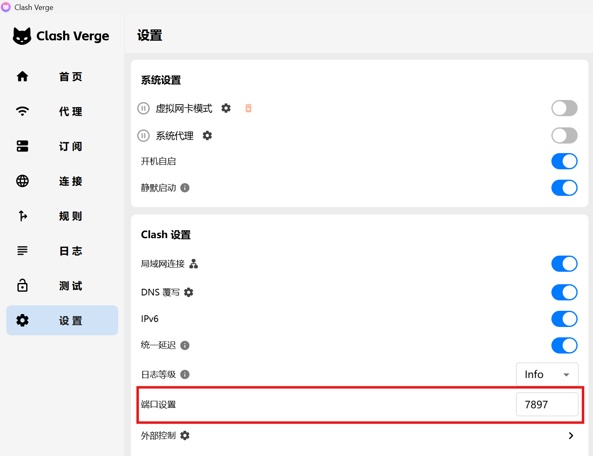
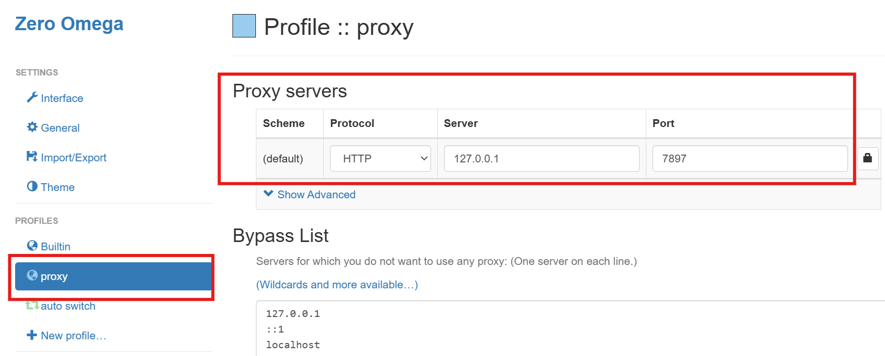
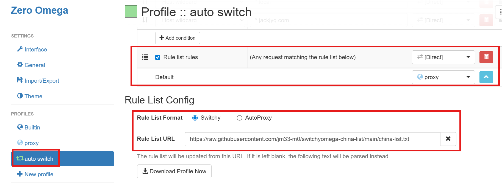

# 🌐 在浏览器自动切换代理

根据 URL 自动切换代理，需要安装 `Proxy SwitchyOmega 3 (ZeroOmega)` 📌

- [Chrome Web Store](https://chromewebstore.google.com/detail/proxy-switchyomega-3-zero/pfnededegaaopdmhkdmcofjmoldfiped)
- [Microsoft Edge Add-ons](https://microsoftedge.microsoft.com/addons/detail/proxy-switchyomega-3-zer/dmaldhchmoafliphkijbfhaomcgglmgd)

🔍 确认 Clash 端口为 `7890`

⚙️ 配置 Proxy SwitchyOmega 3 (ZeroOmega) 为 `http://127.0.0.1:7890`

🔄 配置 Proxy SwitchyOmega 3 (ZeroOmega) 为自动切换模式

- ✅ URL 在列表中：直接连接 Direct
- 🌐 URL 不在列表中：使用代理 Proxy

并订阅境内 URL 列表 `https://raw.githubusercontent.com/jm33-m0/switchyomega-china-list/main/china-list.txt`

