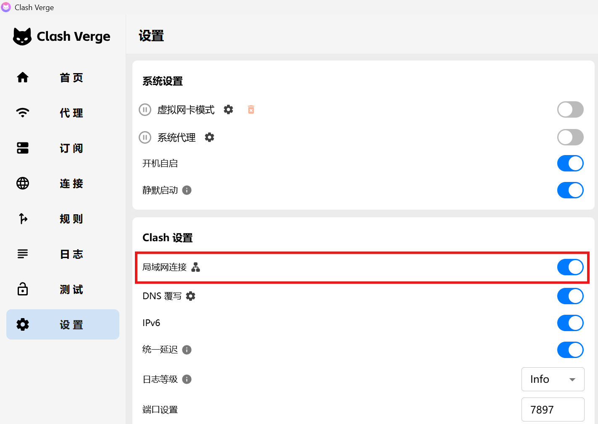

# 在 Terminal 中使用代理

开启 Clash for Windows 的 LAN 访问，并确认端口为 `7897`

在 Windows 防火墙中放行 Clash Verge `C:\program files\clash verge\verge-mihomo.exe`

## WSL 代理配置

若使用 Oh My Zsh ，则在 WSL2 中把 [proxy.zsh](static/proxy.zsh) 中的内容添加到 `~/.oh-my-zsh/custom/proxy.zsh`

## PowerShell 代理配置

在 [Powershell 配置文件](https://learn.microsoft.com/zh-cn/powershell/module/microsoft.powershell.core/about/about_profiles?view=powershell-7.5#profile-types-and-locations) 中粘贴 [proxy.ps1](static/proxy.ps1) 中的内容