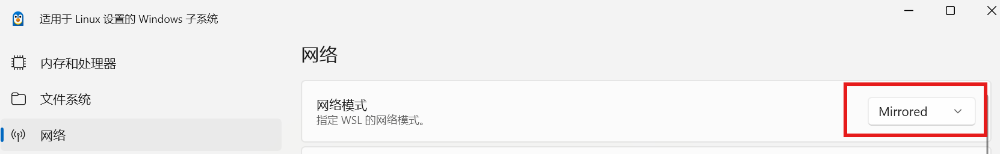
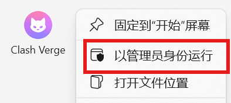
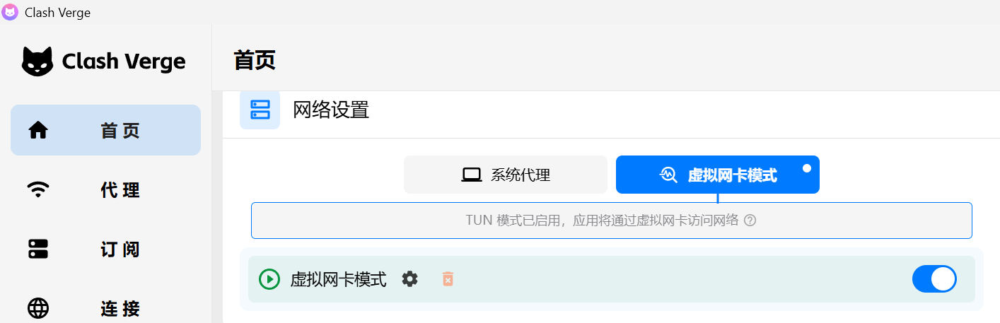
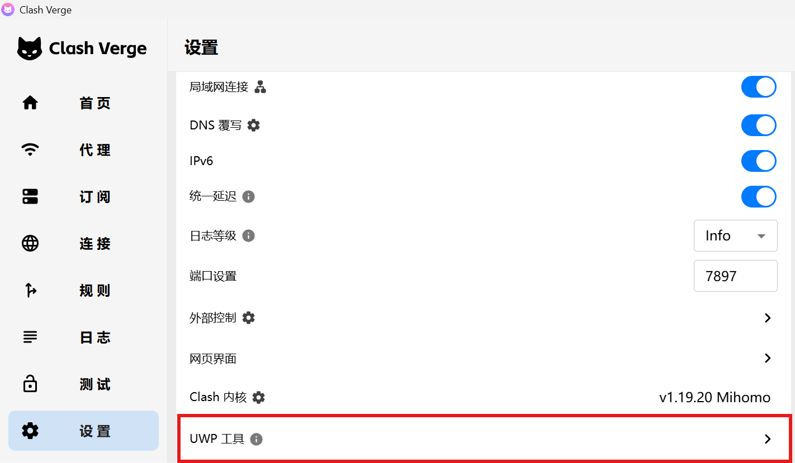

# 使用 TUN 模式强制所有流量通过代理

有的应用如 `docker buildx` 不遵循系统代理设置，需要在 TUN 模式下才能正常工作

## 步骤如下

WSL 网络配置为镜像模式（Mirrored）

使用管理员身份运行 Clash Verge

- 安装 TUN 服务
- 点击齿轮，确认`最大传输单元`为`1500`
- 开启TUN 模式

配置 UWP 工具，放行`适用于 Windows 的 Linux 子系统`（及其它你希望走代理的 UWP 应用）

重启 WSL (在 Powershell 中执行 `wsl --shutdown`)

**注意**：开启 TUN 模式后，无需开启系统代理，也无需设置环境变量

## 参考

- [WSL2 使用 Clash for Windows 的 TUN 模式全局访问外网](https://github.com/ninehills/blog/issues/93)

